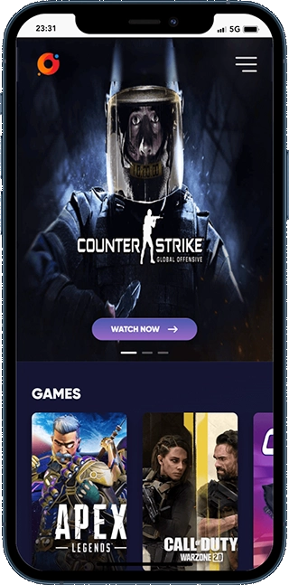
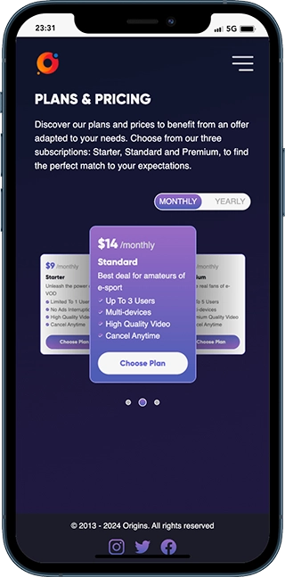
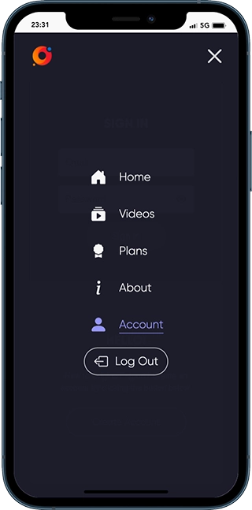
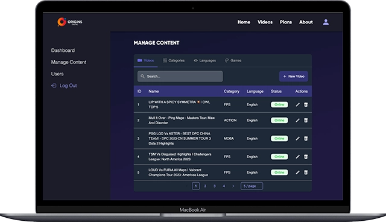
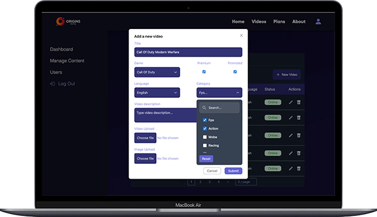

# Origins-E-Sport Project

Origins-E-Sport is an OTT (Over The Top) platform project for hosting e-sport videos.

Based on a freemium model, the single-page application allows visitors to watch streaming content for free but with restricted access. Creating a user account or subscribing to a premium plan unlocks additional videos and features.

A back-office space secured through an authentication system allows an administrator to fully manage the online content and monitor activity on the platform.

This project was developed as part of the Web & Mobile developer certification at the WildCodeSchool.

## Table of contents

- [Screenshots](#screenshots)
- [Getting started](#getting-started)
- [Built with](#built-with)
- [Author](#author)

## Screenshots

- Mobile:

  
  
  
  

- Laptop/Desktop:

  
  

## Getting started

1. Clone the project and run the following command for both frontend and backend folders:

```console
npm install
```

This will initialize the project by installing all the required dependencies.

2. Setup your local database with an SQL dump file:

```console
npm run migrate
```

3. Start the development server:

```console
npm run dev
```

## Built with


## Authors

- Alexis Chesneau : https://github.com/AlexisChesneau
- Denis Dezest: https://github.com/ddZ6ii
- Hafsa Aït Ouarraou : https://github.com/hxfsa
- Jeremy Dohin : https://github.com/Arkantik
- Thibaut Resse : https://github.com/neolink78
